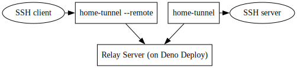

# Home Tunnel

Simple port tunneling using Deno Deploy as a free serverless hosting for the relay station.

Three components:
* Local client running on the host system
* Relay server hosted on Deno Deploy relaying data between local client and remote client
* Remote client running on the remotly machine accessing the forwarded port on the local host system

<!--
https://dreampuf.github.io/GraphvizOnline/?engine=dot#digraph%20G%20%7B%0A%20%7Brank%3Dsame%3B%20ssh_client%3B%20ssh_server%3B%20local%3B%20remote%7D%20%20%20%20%0A%20%20ssh_client%20-%3E%20remote%3B%0A%20%20remote%20-%3E%20relay%3B%0A%20%20local%20-%3E%20relay%3B%0A%20%20local%20-%3E%20ssh_server%3B%0A%0A%20%20remote%20%5Blabel%3D%22home-tunnel%20--remote%22%20shape%3Drect%5D%3B%0A%20%20relay%20%5Blabel%3D%22Relay%20Server%20(on%20Deno%20Deploy)%22%20shape%3Drect%5D%3B%0A%20%20local%20%5Blabel%3D%22home-tunnel%22%20shape%3Drect%5D%3B%0A%20%20ssh_client%20%5Blabel%3D%22SSH%20client%22%5D%3B%0A%20%20ssh_server%20%5Blabel%3D%22SSH%20server%22%5D%3B%0A%7D%0A
-->

# Example

## Setup Relay Server

* Create a Playground server on Deno Deploy
* Copy and paste the home-tunnel-relay.ts code into the playground and press run

# Setup Local Client

* Download binaries for your host system architecture
* Run from terminal
```
home-tunnel --relay <URL for your relay server> --port <e.g. 22 to forward SSH>
 ```
* For persistance install it as a system service
```
sudo install_service.sh <URL for your relay server>
```
* Check status of service with
```
systemctl status home-tunnel.service
```
or (exit by pressing 'q')
```
sudo journalctl  home-tunnel.service
```

# Run Remote Client

* Download binaries for your remote machine architecture
* Run from terminal and mirror port
```
home-tunnel --relay <URL for your relay server> --port <e.g. 22222>
```
* In another terminal use SSH
```
ssh -p 22222 <user on local system>@127.0.0.1
```
* ```ssh-copy-id``` might help increasing password security

# Kown Issues

This is a very basic solution so far and has several uncritical issues.
* Sometimes Deno shutsdown instances leaving dead local client connection. An hourly idle connection reset has been implemented.
* No communication when conneting to data center with different  regions.
* Only the local client has good error handling to ensure survivablity. Restart remote client and relay server when observing issue.

# Alternatives

* Cloudflare Tunnel
* ngrok
* localtunnel
* frp
* bore
* tunnelto
* rathole
